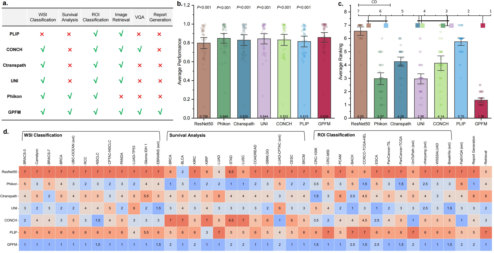

# GPFM
The official implementation of [GPFM](https://arxiv.org/pdf/2407.18449). This project is based on the [CLAM](https://github.com/mahmoodlab/CLAM)  


# How to use GPFM as feature extractor
Take the UBC_OCEAN dataset as an example  
Step 1: segment the tissue of the WSI  
```bash
cd Patching
bash get_coor_scripts/UBC_OCEAN.sh
```
Step 2: extract the features using foundation model. Currently, we support ResNet, Ctranspath, PLIP, Phikon, CONCH, UNI, and GPFM.
```bash
# download the weights of released GPFM and put it at `models/ckpts/`.  
cd root_dir_of_project
bash extract_scripts/UBC_OCEAN.sh
```
If you want to use other foundation models, please download the weights and put them at `models/ckpts/`. You can see the `models/__init__.py` for the supported model. You can also simply define your own model (see `models/phikon.py`).  

# The overall results



# Citing GPFM
If you find this repository useful, please consider giving a star ⭐ and citation 🦖: 

@article{GPFM,  
  title={Towards A Generalizable Pathology Foundation Model via Unified Knowledge Distillation},  
  author={Ma, Jiabo and Guo, Zhengrui and Zhou, Fengtao and Wang, Yihui and Xu, Yingxue and Cai, Yu and Zhu, Zhengjie and Jin, Cheng and Jiang, Xinrui and Lin, Yi and Han, Anjia and others},  
  journal={arXiv preprint arXiv:2407.18449},  
  year={2024}  
}