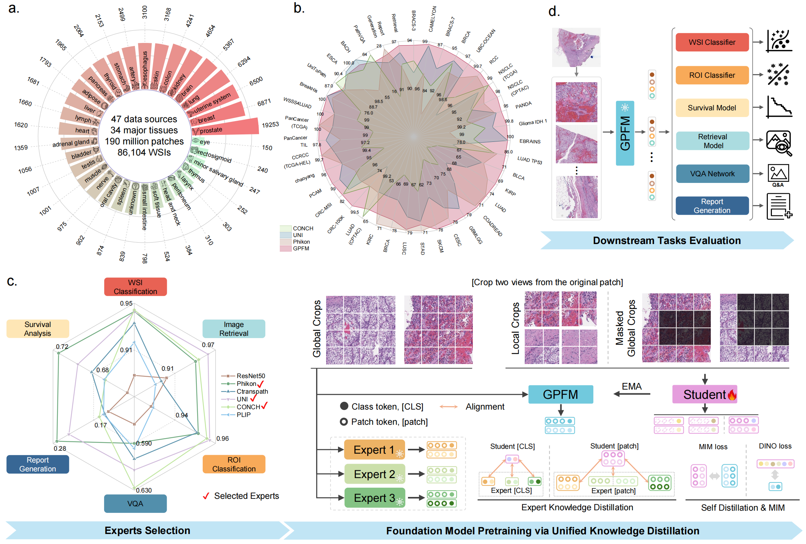

# GPFM

The official implementation of [GPFM](https://arxiv.org/pdf/2407.18449). 
This project is based on the following great projects:
* [CLAM](https://github.com/mahmoodlab/CLAM)  
* [Dinov2](https://github.com/facebookresearch/dinov2)  
see others works of HKUST [SmartLab](https://hkustsmartlab.github.io/) 
 
## TODO List
- [ ] Huggingface lib is under preparing  
- [ ] Downstream tasks are under preparing  

# How to use GPFM as feature extractor
## Using this project
Take the UBC_OCEAN dataset as an example  
Step 1: segment the tissue of the WSI  
```bash
cd Patching
bash get_coor_scripts/UBC_OCEAN.sh
```
Step 2: extract the features using foundation model. Currently, we support ResNet, Ctranspath, PLIP, Phikon, CONCH, UNI, and GPFM.
```bash
# download the weights of released GPFM and put it at `models/ckpts/`.  
cd root_dir_of_project
bash extract_scripts/UBC_OCEAN.sh
```
Click [here](https://github.com/birkhoffkiki/GPFM/releases/download/ckpt/GPFM.pth) to download pretrained GPFM.  
If you want to use other foundation models, please download the weights and put them at `models/ckpts/`. You can see the `models/__init__.py` for the supported model. You can also simply define your own model (see `models/phikon.py`).  

## Using Huggingface
see https://huggingface.co/majiabo/GPFM for details. (Note: under preparing)  

# How to use unified knowledge distillation to pretrain your model
If you use Slurm system, you could use `pretrain/train_script.sh` to pretrain your model. Note that the default Experts used in this project is `UNI`, `CONCH`, and `Phikon`. Please remeber to download the weights of these models and put them at `pretrain/dinov2/weights/`.  
If you want to change the expert, you could modify the code at `pretrain/dinov2/train/ssl_meta_arch.py` (see line 57).

## Link to get experts
* [UNI](https://huggingface.co/MahmoodLab/UNI) 
* [CONCH](https://huggingface.co/MahmoodLab/CONCH) 
* [Phikon](https://huggingface.co/owkin/phikon)


# The overall results


# Citing GPFM
If you find this repository useful, please consider giving a star ⭐ and citation 🦖: 

@article{GPFM,  
  title={Towards A Generalizable Pathology Foundation Model via Unified Knowledge Distillation},  
  author={Ma, Jiabo and Guo, Zhengrui and Zhou, Fengtao and Wang, Yihui and Xu, Yingxue and Cai, Yu and Zhu, Zhengjie and Jin, Cheng and Jiang, Xinrui and Lin, Yi and Han, Anjia and others},  
  journal={arXiv preprint arXiv:2407.18449},  
  year={2024}  
}